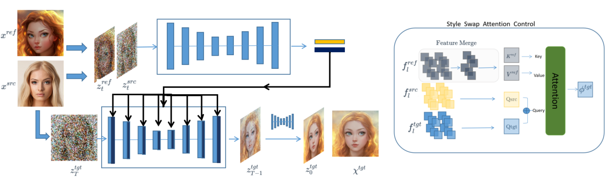
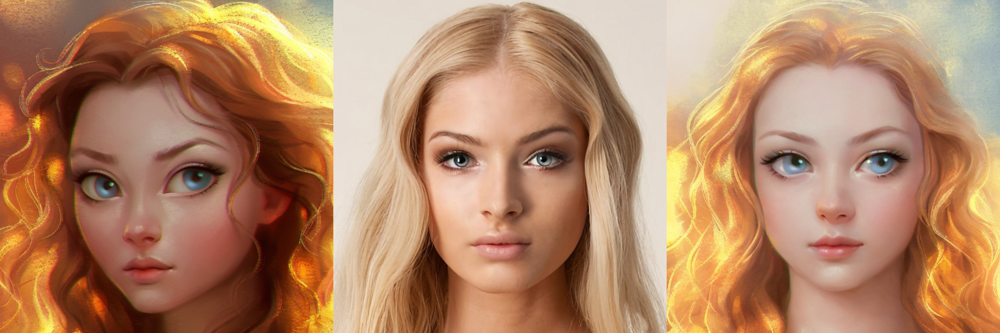
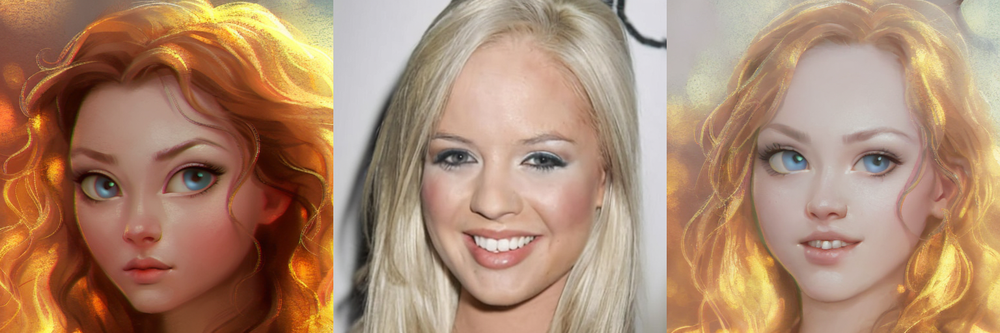
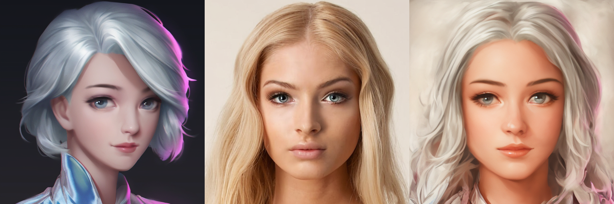
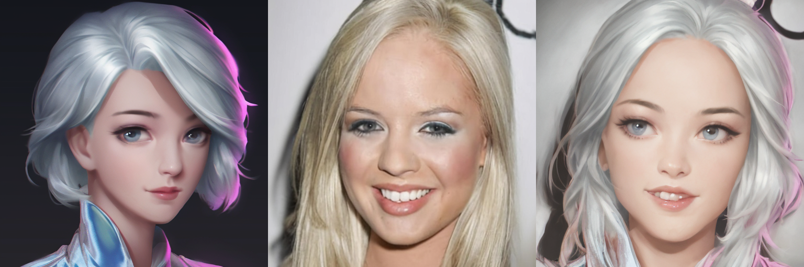

## Training Free Portrait Stylization with Visual Style Prompting

Pytorch implementation of  **<u>Training Free Portrait Stylization with Visual Style Prompting</u>**



## 

Diffusion-based text-to-image generation models have greatly advanced the field of artistic content synthesis. However, current portrait stylization methods typically require fine-tuning models with exemplar images or employing DDIM inversion to map images back to the noise space, both of which significantly slow down the generation process. 

* This project proposes a **training-free and inversion-free portrait stylization framework** based on diffusion models, which achieves the fusion of content and style features in **only 4 or 8 sampling steps**.
* To integrate coherent features extracted from content and style images, we introduce a **style-swap attention control technique** that delicately merges content and style features within the attention space of the target image. 
* To reduce the computational overhead of attention control, we additionally implement a **feature merging strategy** to eliminate redundant features in the feature space.
* can generate a high-quality image within 8 seconds.


| Style | Content | Result |
| :---: | :-----: | :----: |









## To-do

- [x] Release the code.

  

## Usage

### Requirements

We implement our method with [diffusers](https://github.com/huggingface/diffusers) and the code runs on Python 3.9 with Pytorch 2.0.1. You can install the environment by following commands.

```base
conda create -n swapFace python=3.9
conda activate swapFace
conda install pytorch==2.0.1 torchvision==0.15.2 torchaudio==2.0.2 pytorch-cuda=11.8 -c pytorch -c nvidia
pip install diffusers transformers gradio accelerate PEFT xformers==0.0.20
```

### Checkpoints

**Latent Consistency Model:**
Our method mainly based on Latent Consistency Model, [diffusers](https://github.com/huggingface/diffusers) automatically downloads the required model weights. If necessary, you can also manually download them from [this link](https://huggingface.co/SimianLuo/LCM_Dreamshaper_v7).

### Inference with example data:

```bash
bash run.sh
```

### Inference with your own data:

Please place the style and content images into separate folders, and then run the following command.

```bash
export CUDA_VISIBLE_DEVICES=0
python main.py --output 'PATH to Results' \
                    --content' PATH to Content' \
                    --style 'PATH to Style' \
                    --sty_guidance 1.2 \
                    --num_inference_steps 2 \
                    --tome
```

### Run the Local Gradio Demo:

```bash
python app.py
```

## Acknowledgements

Our code follows several excellent repositories. We appreciate them for making their codes available to the public.

- [Prompt-to-Prompt](https://github.com/google/prompt-to-prompt)
- [Masactrl](https://github.com/TencentARC/MasaCtrl)
- [latent-consistency-model](https://github.com/luosiallen/latent-consistency-model)
- [ZoPo](https://github.com/liujin112/ZePo)

